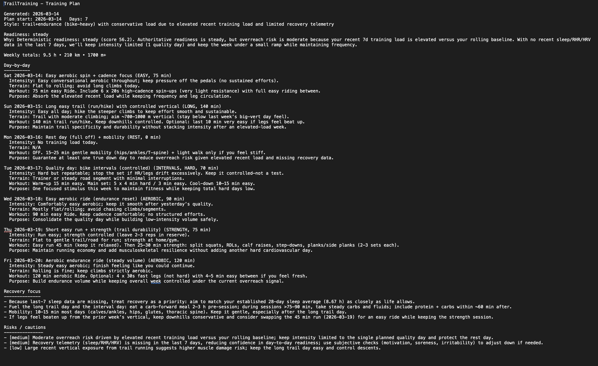

# trailtraining


trailtraining is a local Python CLI for turning activity data and optional recovery telemetry into inspectable training guidance.
It computes simple recent-load and recovery-aware signals, generates coaching outputs from that local context, and evaluates generated training plans against explicit guardrails.

It started from a simple frustration: people collect huge amounts of data from smartwatches, Strava, Garmin, and similar tools, but very little of it gets turned into actionable training decisions. At the same time, the first wave of LLM features inside fitness products felt shallow, generic, and mostly useless for real training.

So I built the tool I wanted for myself: a local, inspectable system that pulls together training and recovery data, estimates readiness and overreach risk, generates structured coaching outputs, and evaluates plans against simple safety rules.

This is **not** a chatbot wrapper around fitness data. The goal is to make wearable data more useful for actual decision-making.


## Engineering highlights

This project is an end-to-end ML-adjacent pipeline built around three ideas:

- **LLM outputs should be evaluated, not trusted.** The `eval-coach` layer
  runs generated training plans through rule-based constraint checks — ramp rate,
  hard-day limits, rest requirements, citation grounding — and returns a structured
  violation report with per-category scores. The LLM is the generator; the evaluator
  is deterministic.

- **Context quality determines output quality.** The pipeline assembles a
  structured local context (load rollups, recovery signals, deterministic readiness
  forecast) before calling the LLM. This is the pipeline design: ingest → compute
  signals → generate from signals → evaluate output.

- **Structured contracts prevent schema drift.** All artifacts (training plans,
  evaluation reports, forecasts) are validated against Pydantic v2 models with
  strict schemas. The OpenAI structured output call uses a matching JSON Schema.

## Quick look: inspect sample outputs

You do **not** need API keys to understand what the project produces.

For representative outputs, see [demo/](demo).
For implementation details, see [docs/engineering.md](docs/engineering.md).

- `demo/rollups/combined_rollups.json`
- `demo/plans/training-plan.json`
- `demo/plans/training-plan.txt`
- `demo/status/recovery-status.md`
- `demo/status/meal-plan.md`



Example generated weekly plan showing readiness context, load-aware reasoning, day-by-day structure, recovery priorities, and explicit cautions.

```
Strava API ─────┐
                ├──► combine.py ──► combined_summary.json
Intervals.icu ──┘                         │
                                          ▼
                              forecast.py (deterministic)
                                          │
                                          ▼
                              coach.py (LLM generation)
                                          │
                                          ▼
                              eval.py + constraints.py
                                          │
                                          ▼
                         eval_report.json (score, grade, violations)
## What it produces
```
The simplified pipeline: unify data → compute signals → generate plan → evaluate plan

## What it does

`trailtraining` can:

- pull activity history from Strava
- optionally pull recovery telemetry from GarminDB or Intervals.icu
- merge local activity and recovery artifacts
- compute simple recent-load, readiness, and overreach-risk signals
- generate a structured weekly training plan plus lighter advisory outputs
- evaluate generated training plans against explicit safety and consistency rules
- support isolated multi-profile setups with `--profile`


## Why this project exists

Most fitness platforms are good at collecting data and bad at using it.

You can record heart rate, sleep, training load, pace, HRV, recovery signals, and workout history for months or years, but the end result is usually one of the following:

- dashboards without clear recommendations
- generic “AI insights” that say very little
- training suggestions that ignore context
- black-box outputs with no clear reasoning

`trailtraining` is an attempt to do something better:

- keep the workflow local and inspectable
- combine multiple sources into a usable training view
- produce structured outputs instead of vague summaries
- add explicit constraints and safety checks
- make generated plans easier to review instead of blindly trust

## What makes it different

The point is not just to “use an LLM for coaching.”

The point is to build a pipeline where:
1. training and wellness data are collected from real sources,
2. useful rollups and forecasts are computed locally,
3. coaching outputs are generated from that context,
4. plans can be checked against simple rules before you use them.

That makes this closer to an **auditable training-planning tool** than a generic AI assistant.

If you are just reviewing the project, start there.

These files show the kind of local rollups, generated plans, and structured outputs the pipeline produces.

## Handling incomplete data

`trailtraining` is designed to degrade gracefully when recovery telemetry is incomplete.

It can operate on activity-only data and improves when recent sleep, resting HR, or HRV data are available.
When recovery telemetry is sparse, forecasts and generated plans should be interpreted more conservatively.

## Plan evaluation

Generated plans are not treated as correct just because they sound plausible.

`eval-coach` checks plans against explicit constraints such as:
- excessive ramp versus recent load
- poor spacing of hard sessions
- insufficient rest
- inconsistencies between day-level sessions and weekly totals
- weak or missing signal grounding

This makes the project closer to a decision-support pipeline than a generic AI coaching wrapper.

# What you can do without setup

Without creating any API credentials, you can:

- read the sample outputs in `demo/`
- inspect the repo structure
- review the command surface
- understand the end-to-end workflow

## What requires setup

To run the full pipeline on your own data, you need:

- Python 3.9+
- a Strava API application
- one wellness source:
  - GarminDB, or
  - Intervals.icu API access
- an OpenAI API key for `coach`

## Installation

```bash
git clone https://github.com/MauriceCC04/trailtraining.git
cd trailtraining

python3 -m venv .venv
source .venv/bin/activate
python -m pip install --upgrade pip
pip install -e .
```

Optional extras:

```bash
pip install -e ".[dev]"
pip install -e ".[analysis]"
```

Verify installation:

```bash
trailtraining -h
```

## Configuration

Profiles load environment variables from:

```bash
~/.trailtraining/profiles/<profile>.env
```

Example:

```bash
mkdir -p ~/.trailtraining/profiles
nano ~/.trailtraining/profiles/alice.env
```

Minimal example:

```bash
STRAVA_CLIENT_ID="..."
STRAVA_CLIENT_SECRET="..."
STRAVA_REDIRECT_URI="http://127.0.0.1:5000/authorization"

# Choose one wellness source

# Garmin
GARMIN_EMAIL="alice@example.com"
GARMIN_PASSWORD="..."

# or Intervals.icu
# INTERVALS_API_KEY="..."
# INTERVALS_ATHLETE_ID="0"

OPENAI_API_KEY="..."
```

By default, per-profile data is stored under:

```bash
~/trailtraining-data/<profile>
```

## Typical workflow

```bash
# 1. Check setup
trailtraining --profile alice doctor

# 2. Authorize data sources
trailtraining --profile alice auth-strava

# 3. Ingest data
trailtraining --profile alice run-all

# 4. Compute signals
trailtraining --profile alice forecast

# 5. Generate coaching output
trailtraining --profile alice coach --prompt training-plan

# 6. Evaluate the output
trailtraining --profile alice eval-coach \
  --input ~/trailtraining-data/alice/prompting/coach_brief_training-plan.json
```

## What it produces

```
Typical outputs live under:
```bash
~/trailtraining-data/<profile>/
├── processing/
└── prompting/
```

In practice, these outputs are intended to answer questions like:

* How recovered do I look right now?
* Am I trending toward overreach?
* What kind of week makes sense from here?
* Does the generated plan violate obvious training constraints?
* Is this output actually useful, or just polished nonsense?

## Repo layout

```text
.
├── .github/workflows/
├── demo/
│   ├── README.md
│   ├── rollups/
│   ├── plans/
│   └── status/
├── docs/
│   ├── engineering.md
│   └── images/
├── src/trailtraining/
├── tests/
├── README.md
└── pyproject.toml
```

## Command reference

Core commands:

```bash
trailtraining --profile alice doctor
trailtraining --profile alice auth-strava
trailtraining --profile alice fetch-strava
trailtraining --profile alice fetch-garmin
trailtraining --profile alice fetch-intervals
trailtraining --profile alice combine
trailtraining --profile alice run-all
trailtraining --profile alice run-all-intervals
trailtraining --profile alice forecast
trailtraining --profile alice coach --prompt training-plan
trailtraining --profile alice eval-coach --input <path>
```

Useful options:

```bash
trailtraining --profile alice run-all --clean
trailtraining --profile alice run-all --clean-processing
trailtraining --profile alice run-all --clean-prompting
trailtraining --profile alice fetch-intervals --oldest 2025-01-01 --newest 2025-03-01
trailtraining --profile alice coach --prompt training-plan --style trailrunning
trailtraining --profile alice coach --prompt training-plan --style triathlon
```

## Development

Install dev dependencies:

```bash
pip install -e ".[dev]"
pre-commit install
```

Run checks:

```bash
pytest
ruff check .
mypy src
```

## Current limitations

- full runs require user-managed credentials and local setup
- data quality depends on upstream providers
- coaching outputs are experimental
- Garmin workflows depend on GarminDB
- this is built for practical usefulness, not as a polished consumer product

## Safety

This is a personal training-data and planning tool.

It is **not** medical software, and generated outputs should not be treated as medical advice. Any training recommendation should be reviewed with common sense and adjusted for injury status, recovery, and individual context.

## Why I think this matters

Wearables already collect more than enough useful data.

The missing piece is turning that data into something useful, reviewable, and grounded enough to help real training decisions. That is what `trailtraining` is trying to do.

## License

MIT
